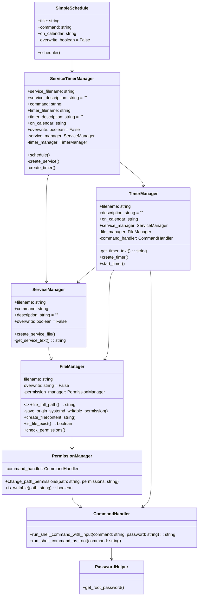

# SchedulerX

## Installation

`pip install SchedulerX`

### Setting ROOT_PASSWORD to env variable 

`export ROOT_PASSWORD="<your-root-password>"`

## Class Diagram of Service Timer Package

```mermaid
classDiagram

class PasswordHelper{
    +get_root_password()
}

class CommandHandler{
    +run_shell_command_with_input(command: string, password: string): string
    +run_shell_command_as_root(command: string)
}

class PermissionManager{
    -command_handler: CommandHandler
    +change_path_permissions(path: string, permissions: string)
    +is_writable(path: string): boolean
}

class FileManager{
    filename: string
    overwrite: string = False
    -permission_manager: PermissionManager
    <<property>> +file_full_path(): string
    -save_origin_systemd_writable_permission()
    +create_file(content: string)
    +is_file_exist(): boolean
    +check_permissions()
}

class ServiceManager{
    +filename: string
    +command: string
    +description: string = ""
    +overwrite: boolean = False
    +create_service_file()
    -get_service_text(): string
}

class TimerManager{
    +filename: string
    +description: string = ""
    +on_calendar: string
    +service_manager: ServiceManager
    -file_manager: FileManager
    -command_handler: CommandHandler
    -get_timer_text(): string
    +create_timer()
    +start_timer()
}

class ServiceTimerManager{
    +service_filename: string
    +service_description: string = ""
    +command: string

    +timer_filename: string
    +timer_description: string = ""
    +on_calendar: string
    +overwrite: boolean = False
    -service_manager: ServiceManager
    -timer_manager: TimerManager
    +schedule()
    -create_service()
    -create_timer()
}

class SimpleSchedule{
    +title: string
    +command: string
    +on_calendar: string
    +overwrite: boolean = False
    +schedule()
}
CommandHandler --> PasswordHelper
PermissionManager --> CommandHandler
FileManager --> PermissionManager
ServiceManager --> FileManager
TimerManager --> ServiceManager
TimerManager --> FileManager
TimerManager --> CommandHandler
ServiceTimerManager --> ServiceManager
ServiceTimerManager --> TimerManager
SimpleSchedule --> ServiceTimerManager

```
